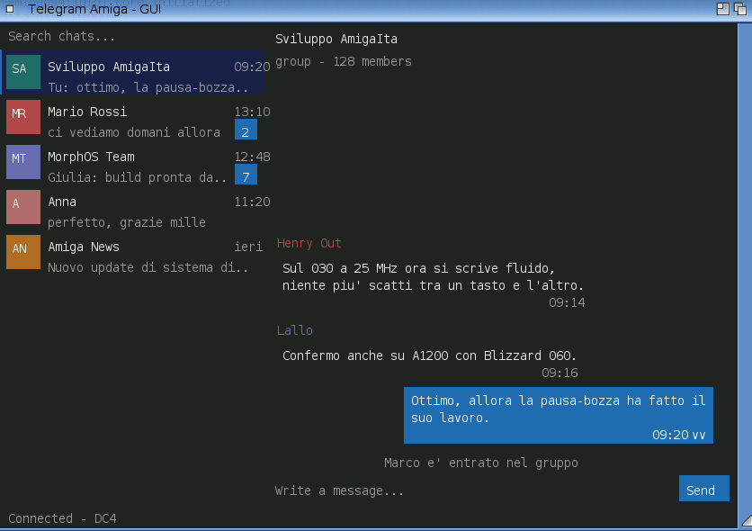

<!--
Copyright (c) 2026 Michele Dipace <michele.dipace@kaffeine.net>
SPDX-License-Identifier: MIT
-->

# Telegram Amiga

A from-scratch, native **MTProto Telegram client** for Amiga-family systems —
log in with a normal Telegram account, list your chats and exchange messages.
**Zero external dependencies**: no MUI, no ixemul, no AmiSSL. All the
cryptography (RSA, Diffie-Hellman, SRP/2FA, AES, SHA) is built in.

Two front-ends share one engine:

- **TelegramAmiga** — a native Intuition/GadTools GUI: chat list with real
  avatars and persistent unread badges, conversation view, scrollbars (wheel,
  knob drag, arrow keys, pixel scroll), scroll-to-top history paging,
  click-to-compose with multi-line wrap, online chat search, drag-and-drop
  reorder and remove, live receive, "&lt;name&gt; is typing", read receipts,
  file sharing and a pinned Saved Messages chat. A double-click starts it with
  no flashing console and no launcher script. Drawn by the client itself on a
  RastPort.
- **TelegramAmiga-TUI** — the text/console client, at home on a 68030 with a
  serial console: same engine, launched from the second icon.



Status: **alpha 0.0.7** — everyday direct-message and group chat works on all
five platforms below. 0.0.7 adds large-file uploads using
Telegram's big-file protocol (about 31 MiB on m68k and 250 MiB elsewhere),
file send/download and Workbench drop support in the TUI, transcript and
composer text selection with Copy/Cut/Paste, live updates for messages edited
on another device, and receive-only updates while composing. It builds on
0.0.6's file sharing, pinned Saved Messages transfer drawer, script-free
launch icons, click-to-place caret, Iconify/AppIcon support and RTG avatar
colours.

License: MIT — a non-commercial community project, a gift to the Amiga
community. Development diary:
<https://androidlab.it/en/telegram-amiga-mtproto-client-development-diary/>

## Platforms & releases

Each 0.0.7 package bundles both clients, icons, a public `telegram-api.txt` and
per-architecture IT/EN manuals — and **no private files**.

| Platform | CPU | Release |
|---|---|---|
| AmigaOS 3.x (68020+) | m68k | [os3-alpha-0.0.7](https://github.com/kaffeine1/telegram-amiga/releases/tag/os3-alpha-0.0.7) |
| AmigaOS 4.x | PPC | [os4-alpha-0.0.7](https://github.com/kaffeine1/telegram-amiga/releases/tag/os4-alpha-0.0.7) |
| MorphOS | PPC | [morphos-alpha-0.0.7](https://github.com/kaffeine1/telegram-amiga/releases/tag/morphos-alpha-0.0.7) |
| AROS i386 (ABIv0) | x86 | [aros-i386-alpha-0.0.7](https://github.com/kaffeine1/telegram-amiga/releases/tag/aros-i386-alpha-0.0.7) |
| AROS x86_64 | x86-64 | [aros-x86_64-alpha-0.0.7](https://github.com/kaffeine1/telegram-amiga/releases/tag/aros-x86_64-alpha-0.0.7) |

All releases: <https://github.com/kaffeine1/telegram-amiga/releases>

AmigaOS 3.x is a native clib2 build (no ixemul, no AmiSSL) and needs a 68020 or
better. AROS x86_64 targets trunk-SDK-matched systems (AROS One v0.38 pairs a
different kickstart and will not run it); AROS i386 ABIv0 is the broadest AROS
build.

## Quick start

1. Download your platform's package and copy the drawer to a **writable**
   volume (e.g. `Work:`) — it writes its files next to itself, so not the CD.
2. Double-click **TelegramAmiga** — it opens the GUI directly, with no flashing
   console window — or **TelegramAmiga-TUI** for the console client.
3. First run signs you in: phone number → login code → optional 2FA password. A
   `telegram-auth.bin` session is saved; later runs go straight to your chats.

> **2FA on a slow 68k:** Telegram's two-step key derivation is PBKDF2 (100000×
> SHA-512) — about 40 minutes on a stock 14 MHz 68020, long enough that Telegram
> drops the login first. On such machines disable Two-Step Verification (Telegram
> app → Settings → Privacy and Security) before signing in. The client warns at
> the password prompt rather than blocking, so faster/accelerated 68k can still try.

Full IT/EN instructions are inside each package.

## What works

- MTProto auth-key creation, phone/code login wizard, 2FA, saved session.
- Chat list (users, basic groups, channels/supergroups): the full list is
  fetched once on first login, then your curation wins — drag-reorder, remove
  (menu / Del / right-Amiga+R), online search to add, persistent unread badges.
- Reading history with scroll-to-top paging (load older on demand) and sending
  long, multi-line text where the account has permission.
- **File sharing**: download any received file; upload up to about 31 MiB on
  m68k or 250 MiB on the other builds; use pinned **Saved Messages** as a cloud
  transfer drawer. The TUI supports send/download and Workbench drops too.
- Message **edit & delete** (right-click), live remote-edit updates, replies,
  @username autocomplete.
- Mouse/keyboard text selection and **Copy/Cut/Paste** in the transcript and
  composer.
- Real **profile-picture avatars** (blurred previews instantly, crisp on open).
- Native GUI scrolling (wheel / scrollbar / arrows / pixel), remembered window
  size and position, optional own screen, Iconify to a Workbench AppIcon, dark
  theme, script-free flashless Workbench launch.
- Live receive, **"&lt;name&gt; is typing…"**, **read receipts (v / vv)**,
  message styling/entities, reply quotes, cross-chat notifications.
- `gzip_packed` responses decoded in-tree (embedded `puff`, no zlib needed).

## Not yet

Inline photo rendering, reactions, contact management, cross-DC file downloads,
and background/cancellable transfers. The aim is a dependable text-and-files
client first; rich media comes later only where the platform makes it realistic.

## Privacy & security

Never publish these (or screenshots/logs that reveal them):

```
telegram-auth.bin   phone-code-hash.txt   telegram-password.txt
telegram-peers.txt  telegram-seed.bin     telegram-token.txt
```

`telegram-auth.bin` is your logged-in Telegram session — anyone who gets it can
access your account; if it leaks, treat the account as compromised.

On targets without a system CSPRNG/TLS, the crypto secrets come from an in-tree
DRBG seeded from local entropy (timer jitter, keystrokes, a persisted
`telegram-seed.bin`). A first login in a fresh emulator/VM is the weakest
moment — prefer real hardware, or an AmiSSL/OpenSSL target, if your threat model
needs it.

## Build (developers)

Five lanes — see the `Makefile.*` files and `docs/`: AmigaOS 3.x (m68k clib2),
AmigaOS 4 (PPC), MorphOS (PPC), AROS i386, AROS x86_64. Host smoke test:

```sh
make -f Makefile.aros clean all ENABLE_GZIP=0 ENABLE_GZIP_PUFF=1
./build/TelegramAmiga --mtproto-self-test-fast
```

A token-based Bot API mode remains in the tree for diagnostics and TLS/HTTP
validation; it is no longer the product direction.

## Notes

Developed with the help of AI agents used as engineering tools (analysis,
implementation, packaging, docs, test prep). Local diaries, transcripts and
secrets stay out of Git.

Useful bug reports: platform + version, real/emulated, CPU, TCP/IP stack, and
what failed — secrets removed. Never post tokens, auth files, phone numbers,
login codes, 2FA passwords or private message text.
